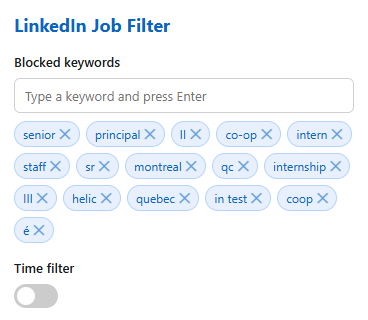

# 🎯 LinkedIn Job Filter

> A lightweight Manifest V3 Chrome extension designed to cut through the noise on LinkedIn Jobs by hiding irrelevancies, unwanted companies, and repeat listings in real time.


---

## 🖼️ Demo



---

## 🚀 Overview

Searching for jobs on LinkedIn often means scrolling through hundreds of duplicate postings, promoted listings, staffing agencies, or roles that don't fit your target criteria. 

**LinkedIn Job Filter** runs locally in your browser, automatically evaluating job cards on the fly against your custom parameters and removing or dimming listings that match your blocklists.

---

## ✨ Key Features

* **🚫 Blacklist Companies:** Permanently hide job posts from specific companies or high-volume recruiting agencies.
* **🔑 Keyword Blocking:** Filter out listings based on forbidden job title keywords (e.g., `Senior`, `Lead`, `Intern`, `Contract`, `Unpaid`).
* **📌 Promoted & Applied Toggles:** Hide "Promoted" posts or roles you’ve already applied to or viewed.
* **⚡ Real-Time DOM Mutation:** Filters apply instantly as you scroll or navigate pagination without slowing down the page.
* **🔒 Privacy-First:** No external servers, no tracking analytics, and no data leaves your browser. All preferences are stored securely using `chrome.storage.local`.

---

## 🛠️ Installation (Local Developer Mode)

Since this extension is built using Manifest V3, you can easily load it into Chrome without needing to install it from the Web Store:

1. **Clone or Download** this repository:
   ```bash
   git clone [https://github.com/jkomonen/linkedin-job-filter.git](https://github.com/jkomonen/linkedin-job-filter.git)
